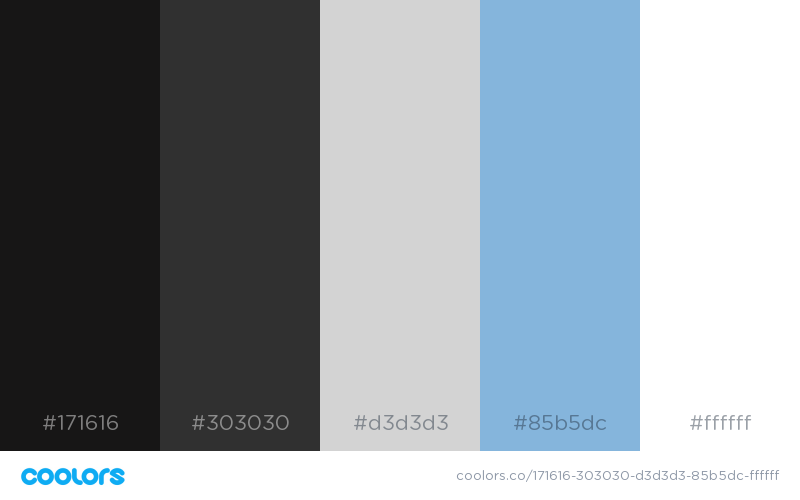

## **Design Document**
### **Introduction**
CapCity Presents is a show promotion/booking agency. CapCity Presents' Website will be a one-stop informational page for concert patrons to learn about what it is, who's behind it, and what events are coming up. It will also be easy for booking agents and bands to make contact with Andy Moreno, who runs it.

### **General**
**Color Theme**
The following colors are the desired color theme as indicated by the client. We settled on these colors so as to stay consistent with the black-and-white logo, while adding a slight splash of color to zest things up.

<strong>Eerie Black</strong> - #171616 
<strong>Jet</strong> - #303030 
<strong>Light Gray</strong> - #d3d3d3 
<strong>Light Cobalt Blue</strong> - #85b5dc 
<strong>White</strong> - #ffffff 

**Logo** 
 Aligned top-left, all logo assets can be found in `images/logo`.

**Navigation**
 A simple, borderless navigation aligned top-right. A touch of blue in between each word to accent.

<em>I would like to test having these header items 'stick' to the top of the page as the user scrolls.</em>

**Footer**
 Social media icons aligned left.
 Copyright, privacy policy, and TOS links aligned right.

### **index.html**
**Carousel**
The carousel will only feature images to draw people in and immediately know what the website is about. They will not be linked to anything.

**Carousel Images**
 Key: c stands for carousel, number represents order in which they appear.
1. (c_1.png)
2. (c_2.png)
3. (c_3.png)

Text below each image will highlight something positive about CapCity Presents.

**Images Below**
 Key: first number is for page 1, second number is image order from left to right.
1. (1-1.png)
2. (1-2.png)
3. (1-3.png)

### **about.html**
This page intends to inform the user what CapCity Presents does and the people behind the operation.

**Introduction to Andy**

Image to the left of text block will be (andy.png) 
To the right, a brief description of Andy's experience and accomplishments.

**Images below**
Order of images are to depict CapCity's Leadership Progression. 
Key: first number is for page 2, second number is image order from left to right.
1. (2-1.png)
2. (2-2.png)
3. (2-3.png)

Text below each photo will describe the timeframe it was taken and who was involved at the time.

### **events.html**

The most important aspect of this page is that the Facebook Events plugin is installed and displaying all upcoming events. If this is not possible to do with images on each side as depicted in the Information Architecture diagram, the images may be left off alltogether.

**Images to the left** 
Key: first number is for page 3, second number is image order from top to bottom.
1. (left-3-1.png)
2. (left-3-2.png)
3. (left-3-3.png)

**Images to the right** 
Key: first number is for page 3, second number is image order from top to bottom.
1. (right-3-1.png)
2. (right-3-2.png)
3. (right-3-3.png)

### **contact.html**
This page's purpose is to provide contact information to visitors of the website. There will be a brief blurb regarding contacting CapCity Presents. 

**Image at the top** 
(oly.png)

**Form and contact information below** 
The submission form will be aligned to the left, contact information will be aligned to the right.
